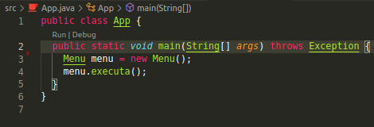

# Controle de Estacionamento Pago
Sistema para realizar o controle de acesso e faturamento de um estacionamento 
pago.

[Diagrama de classes no Drawio](https://drive.google.com/file/d/1WHVr1nQ8FEHHnq8d2CB9gBRIKKJ7W_iZ/view?usp=sharing).

## Baixar
Voce pode baixar o código fonte clicando no botão verde dessa 
[página](https://github.com/yudi-azvd/controle-estacionamento-pago) ou 
executando os seguintes comandos no terminal:

    git glone https://github.com/yudi-azvd/controle-estacionamento-pago

    cd controle-estacionamento-pago

## Usar 
É possível usar o aplicativo com 
[Visual Studio Code](https://code.visualstudio.com/download) instalando o 
[pacote de extensões Java](https://marketplace.visualstudio.com/items?itemName=vscjava.vscode-java-pack). Se tudo deu certo voce verá algo assim no arquivo `src/App.java`:

Então você vai poder rodar o projeto clicando em `Run`.

**Alternativamente**, se você estiver usando Linux ou 
[WSL](https://docs.microsoft.com/en-us/windows/wsl/about), você pode fazer a 
build do projeto executando o script `build.sh` e logo em seguida executar a 
aplicação:

    ./build.sh

    ./controle-estacionamento-pago.jar

Certifique-se de que o você tem permissões de execução do arquivo `build.sh`. Se
não tiver, basta executar:

    chmod +x build.sh

### Participantes

- [Eduardo Levenhagem](https://github.com/MegahNevel)
- [guigudf](https://github.com/guigudf)
- [Guilherme Andreúche](https://github.com/streeg)
- [Pablo Santos](https://github.com/pablo0359)
- [Yudi Yamane](https://github.com/yudi-azvd)

#### Criar um JAR
- [https://www.baeldung.com/java-create-jar](https://www.baeldung.com/java-create-jar)
- [https://stackoverflow.com/questions/4597866/java-creating-jar-file](https://stackoverflow.com/questions/4597866/java-creating-jar-file)
