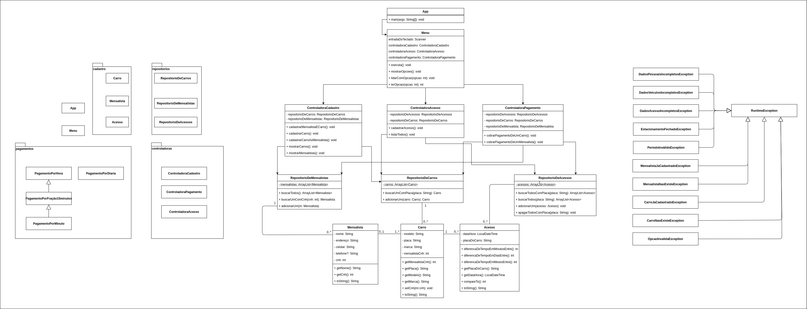

# Controle de Estacionamento Pago
Sistema para realizar o controle de acesso e faturamento de um estacionamento 
pago.

[Diagrama de classes no Drawio](https://drive.google.com/file/d/1WHVr1nQ8FEHHnq8d2CB9gBRIKKJ7W_iZ/view?usp=sharing).

## Baixar
Voce pode baixar o código fonte clicando no botão verde dessa 
[página](https://github.com/yudi-azvd/controle-estacionamento-pago) ou 
executando os seguintes comandos no terminal:

    git glone https://github.com/yudi-azvd/controle-estacionamento-pago

    cd controle-estacionamento-pago

## Build
É possível usar o aplicativo com 
[Visual Studio Code](https://code.visualstudio.com/download) instalando o 
[pacote de extensões Java](https://marketplace.visualstudio.com/items?itemName=vscjava.vscode-java-pack). 
Se tudo deu certo voce verá algo assim no arquivo `src/App.java`:

Então você vai poder rodar o projeto clicando em `Run`.

**Alternativamente**, se você estiver usando Linux ou 
[WSL](https://docs.microsoft.com/en-us/windows/wsl/about), você pode fazer a 
build do projeto executando o script `build.sh` e logo em seguida executar a 
aplicação:

    ./build.sh

    ./controle-estacionamento-pago.jar

Se não der certo é possível tentar executar com

    java -jar controle-estacionamento-pago.jar

Certifique-se de que o você tem permissões de execução do arquivo `build.sh`. Se
não tiver, basta executar:

    chmod +x build.sh

## Instruções de Uso
Essa é uma aplicação textual, então você vai interagir com o sistema digitando
as informações pedidas no terminal. 

Na pasta `casos`, existem alguns arquivos texto que podem ser usados para 
preencher o sistema com mais facilidade. Cada linha representa o que uma pessoa
digitaria no programa como se ela estivesse digitando manualmente. 
Basta copiar todo o conteúdo de um arquivo de interesse 
(<kbd>Ctrl</kbd>+<kbd>A</kbd>, <kbd>Ctrl</kbd>+<kbd>C</kbd>), iniciar o programa 
e colar (<kbd>Ctrl</kbd>+<kbd>V</kbd>) o conteúdo no terminal logo em seguida.

Se você testar um caso novo (que não está em `casos`) constantemente, é 
aconselhado que você crie um arquivo para facilitar o preenchimento do sistema.

## Notas
- O programa não deixa adicionar mais de dois acessos antes de fazer a cobrança de
pagamento de um carro ou mensalista.

- Só é possível cadastrar um mensalista junto com o seu carro, mas é possível 
cadastrar carros sem mensalistas. Além disso, é possível associar um carro já 
cadastrado a um mensalista cadastrado.

### Participantes

- [Eduardo Levenhagem](https://github.com/MegahNevel)
- [Guilherme dos Santos](https://github.com/guigudf)
- [Guilherme Andreúce](https://github.com/streeg)
- [Pablo Santos](https://github.com/pablo0359)
- [Yudi Yamane](https://github.com/yudi-azvd)

<!-- #### Criar um JAR
- [https://www.baeldung.com/java-create-jar](https://www.baeldung.com/java-create-jar)
- [https://stackoverflow.com/questions/4597866/java-creating-jar-file](https://stackoverflow.com/questions/4597866/java-creating-jar-file) -->
